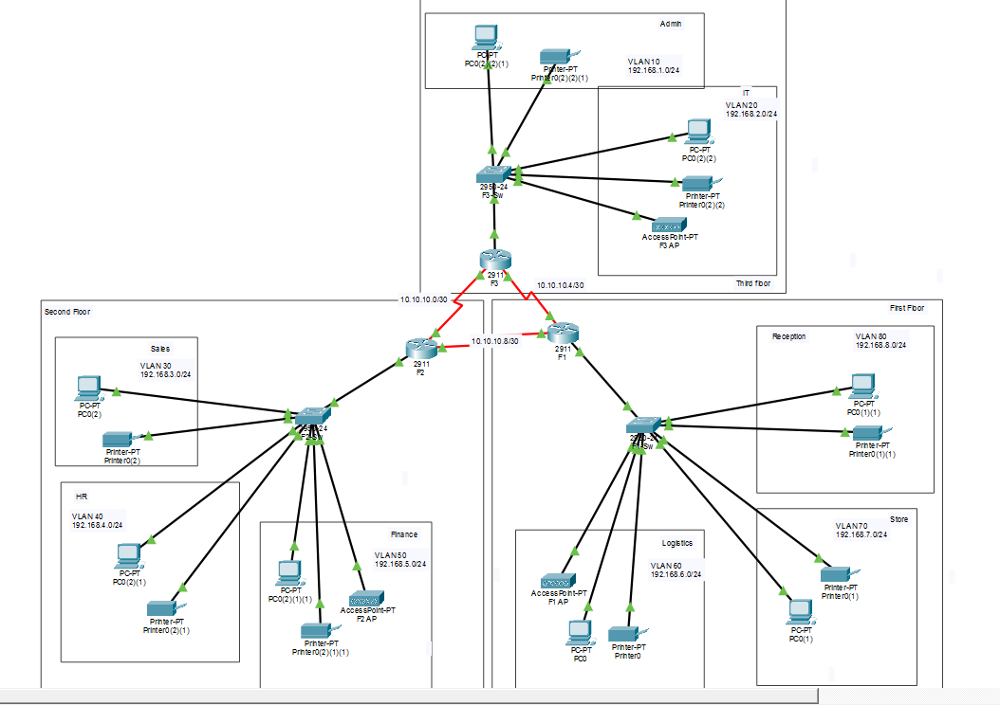
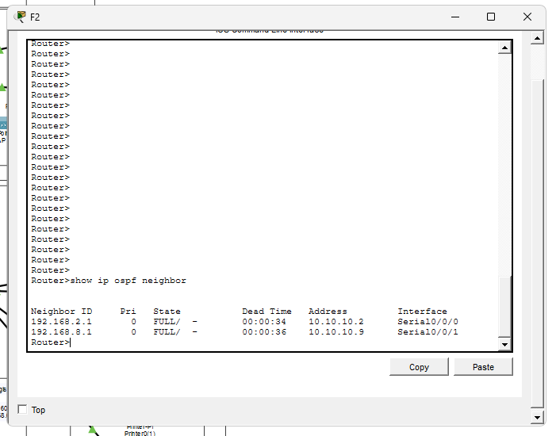

# 🏨 Vic Modern Hotel — Progetto di Rete Enterprise

> Simulazione di una rete enterprise multi-piano realizzata in Cisco Packet Tracer, con inter-VLAN routing, routing dinamico OSPF, DHCP centralizzato, accesso remoto SSH.

---

## 📋 Indice

- [Panoramica](#panoramica)
- [Topologia di Rete](#topologia-di-rete)
- [Requisiti e Tecnologie](#requisiti-e-tecnologie)
- [Schema VLAN e Indirizzamento IP](#schema-vlan-e-indirizzamento-ip)
- [Interconnessioni tra Router](#interconnessioni-tra-router)
- [Riepilogo Configurazioni](#riepilogo-configurazioni)
- [Screenshot](#screenshot)
- [Come Aprire il Progetto](#come-aprire-il-progetto)
- [Test e Verifica](#test-e-verifica)

---

## Panoramica

Questo progetto simula la rete enterprise completa del **Vic Modern Hotel**, una struttura su tre piani con otto dipartimenti, connettività wireless per ogni piano e infrastruttura di routing centralizzata.

La rete è stata progettata e configurata interamente in **Cisco Packet Tracer** come esercizio pratico per consolidare le seguenti competenze:

- Progettazione LAN gerarchica (livelli access/distribution)
- Segmentazione tramite VLAN e trunking 802.1Q
- Inter-VLAN routing
- Routing dinamico OSPFv2 tra router collegati con link seriali
- Server DHCP centralizzato (un pool per VLAN, configurato sul router di piano)
- Accesso remoto SSH v2

---

## Topologia di Rete




---

## Requisiti e Tecnologie

| Componente | Dettaglio |
|---|---|
| Router | 3× Cisco 2911 (uno per piano) |
| Switch | 3× Cisco 2960 (uno per piano) |
| Collegamento tra router | Cavi seriali DCE/DTE (clock rate 64000) |
| VLAN | 8 VLAN distribuite su 3 piani |
| Trunking | 802.1Q sulle porte uplink degli switch (Fa0/1) |
| Inter-VLAN routing | Router-on-a-Stick (subinterface) |
| Indirizzamento dinamico | DHCP — un pool per VLAN, configurato su ogni router |
| Protocollo di routing | OSPFv2 (process ID 10, area 0) |
| Rete wireless | Access Point per ogni piano (SSID dedicato) |
| Accesso remoto | SSH v2 |
| Dispositivi finali | PC, laptop, smartphone, tablet, stampanti |

---

## Schema VLAN e Indirizzamento IP

### 🔴 Primo Piano (Router F1)

| Dipartimento | VLAN | Rete | Default Gateway |
|---|---|---|---|
| Reception | VLAN 80 | 192.168.8.0/24 | 192.168.8.1 |
| Store | VLAN 70 | 192.168.7.0/24 | 192.168.7.1 |
| Logistics | VLAN 60 | 192.168.6.0/24 | 192.168.6.1 |

### 🟡 Secondo Piano (Router F2)

| Dipartimento | VLAN | Rete | Default Gateway |
|---|---|---|---|
| Finance | VLAN 50 | 192.168.5.0/24 | 192.168.5.1 |
| HR | VLAN 40 | 192.168.4.0/24 | 192.168.4.1 |
| Sales | VLAN 30 | 192.168.3.0/24 | 192.168.3.1 |

### 🔵 Terzo Piano (Router F3)

| Dipartimento | VLAN | Rete | Default Gateway |
|---|---|---|---|
| IT | VLAN 10 | 192.168.1.0/24 | 192.168.1.1 |
| Admin | VLAN 20 | 192.168.2.0/24 | 192.168.2.1 |

---

## Interconnessioni tra Router

I tre router sono collegati tramite link seriali **DCE/DTE** con sottoreti punto-a-punto /30:

| Collegamento | Rete | IP lato F3 | IP lato F2/F1 |
|---|---|---|---|
| F3 ↔ F2 | 10.10.10.0/30 | 10.10.10.1 | 10.10.10.2 |
| F3 ↔ F1 | 10.10.10.4/30 | 10.10.10.5 | 10.10.10.6 |
| F2 ↔ F1 | 10.10.10.8/30 | 10.10.10.9 | 10.10.10.10 |

Le interfacce DCE hanno il clock rate impostato a `64000`.

---

## Riepilogo Configurazioni

### Inter-VLAN Routing (Sub-interfaces)

Ogni router utilizza subinterface sulla porta GigabitEthernet 0/0, una per ogni VLAN:

```
interface GigabitEthernet0/0.80
 encapsulation dot1Q 80
 ip address 192.168.8.1 255.255.255.0
```

### DHCP (per router, per VLAN)

```
ip dhcp pool Reception
 network 192.168.8.0 255.255.255.0
 default-router 192.168.8.1
 dns-server 192.168.8.1
```

### OSPF (tutti i router, area 0)

```
router ospf 10
 network 10.10.10.0 0.0.0.3 area 0
 network 192.168.8.0 0.0.0.255 area 0
 ! ... (tutte le reti direttamente connesse)
```

### Configurazione SSH

```
hostname F1-Router
ip domain-name lab.local
username admin password <password>
crypto key generate rsa
! (modulo: 1024 bit)
line vty 0 15
 login local
 transport input ssh
```

---

## Screenshot

> Sostituisci ogni segnaposto con gli screenshot reali esportati da Packet Tracer.
> Tutti i file vanno salvati nella cartella `screenshots/` nella root del repository.

### Topologia Completa

> 📸 **[INSERIRE — Vista completa della topologia, tutti e tre i piani visibili]**
> ```markdown
> 
> ```

### Tabella VLAN (per switch)

> 📸 **[INSERIRE — Output di `show vlan brief` su ciascuno switch]**
> ```markdown
> 
> ```

### Adiacenze OSPF

> 📸 **[INSERIRE — Output di `show ip ospf neighbor` su uno dei router]**
> ```markdown
> 
> ```

### Binding DHCP

> 📸 **[INSERIRE — Output di `show ip dhcp binding` su uno dei router]**
> ```markdown
> 
> ```

### Test Accesso SSH

> 📸 **[INSERIRE — Prompt del Test-PC: `ssh -l admin <ip-router>`, login riuscito]**
> ```markdown
> 
> ```

### Verifica Port Security

> 📸 **[INSERIRE — Output di `show port-security interface fa0/2` sullo switch F3]**
> ```markdown
> 
> ```

### Ping Cross-VLAN e Cross-Piano

> 📸 **[INSERIRE — Ping da PC del dipartimento IT verso PC del dipartimento Logistics (piani e VLAN diversi)]**
> ```markdown
> 
> ```

---

## Come Aprire il Progetto

1. Scarica e installa [Cisco Packet Tracer](https://www.netacad.com/courses/packet-tracer) (versione 8.x consigliata)
2. Clona il repository:
   ```bash
   git clone https://github.com/<tuo-username>/vic-modern-hotel-network.git
   ```
3. Apri il file `.pkt` con Packet Tracer
4. Tutte le configurazioni sono già caricate — usa la **Simulation Mode** per tracciare i flussi di pacchetti

---

## Test e Verifica

Una volta aperto il file, è possibile verificare il corretto funzionamento della rete:

| Test | Procedura |
|---|---|
| Assegnazione DHCP | Clicca su un PC → Desktop → IP Configuration → seleziona DHCP |
| Ping inter-VLAN | Apri il prompt dei comandi di un PC, esegui ping verso un dispositivo in una VLAN diversa |
| Ping cross-piano | Ping da IT (192.168.1.x) verso Reception (192.168.8.x) |
| Login SSH | Dal Test-PC: `ssh -l admin <ip-router>` |
| Port security | Collega un secondo PC alla porta Fa0/2 dello switch IT — la porta deve andare in shutdown |
| Connettività wireless | Verifica la connessione SSID di laptop e smartphone per ogni piano |

---

## Struttura del Repository

```
vic-modern-hotel-network/
├── vic-modern-hotel.pkt          # File del progetto Packet Tracer
├── README.md                     # Questo file
└── screenshots/
    ├── topology-overview.png
    ├── vlan-table-f1.png
    ├── vlan-table-f2.png
    ├── vlan-table-f3.png
    ├── ospf-neighbors.png
    ├── dhcp-bindings.png
    ├── ssh-login-test.png
    ├── port-security-verify.png
    └── ping-cross-vlan.png
```

---

## Competenze Dimostrate

`Cisco IOS` `VLAN` `802.1Q Trunking` `Router-on-a-Stick` `OSPF` `DHCP` `SSH` `Port Security` `Subnetting` `Serial DCE/DTE` `Wireless LAN` `Packet Tracer`
